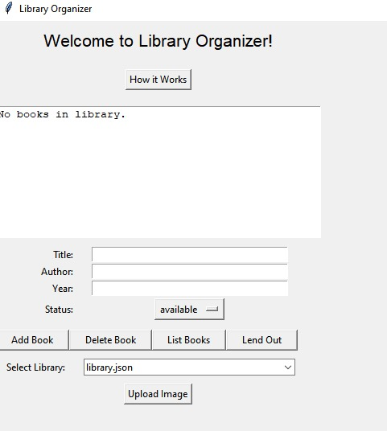

# 📚 Library Organizer (Tkinter + JSON)

Library Organizer built with Python Tkinter and JSON backend to manage and search book collections. Supports multiple libraries, soft delete, lending, and image uploads. Tested with unittest and mocks, ensuring reliability with unit, integration, and system coverage.

---

## ✨ Features
- **Add Books** – store title, author, year, and status  
- **Delete Books** – books are marked as *deleted* instead of permanently removed  
- **Lend / Return Books** – manage book availability status  
- **Search Function** – filter by title, author, year, or status  
- **Multiple Libraries** – create and switch between different `.json` databases  
- **Image Upload** – upload/view book cover images (via Pillow)  
- **How it Works Window** – built-in tutorial/guide  

---

## 🖥️ GUI Preview
Run the app to open the Tkinter GUI:



```bash
python library_main.py
````

---

## 🛠️ Installation & Setup

1. **Clone the repository**

   ```bash
   git clone https://github.com/yourusername/LibraryOrganizer.git
   cd LibraryOrganizer
   ```

2. **(Optional) Create a virtual environment**

   ```bash
   python -m venv .venv
   # Activate it:
   # Linux/macOS:
   source .venv/bin/activate
   # Windows:
   .venv\Scripts\activate
   ```

3. **Install dependencies**

   ```bash
   pip install pillow
   ```

   > On Linux you may also need:
   > `sudo apt install python3-tk`

---

## 🚀 Usage

Start the program:

```bash
python library_main.py
```

From the GUI you can:

* Add new books
* Delete/restore books
* Lend out books
* Search your collection
* Switch between libraries
* Upload images

Your books are stored in JSON files like `library.json`.

---

## ✅ Running Tests

The project includes **unit, integration, and system tests**.

Run them all:

```bash
python -m unittest discover -s . -p "*test.py" -v
```

* `unit_test.py` → backend logic
* `integration_test.py` → frontend ↔ backend interaction
* `system_test.py` → end-to-end flow

---

## 📂 Project Structure

```
LibraryOrganizer/
│
├── library_main.py         # Tkinter GUI frontend
├── library_model.py        # Backend (JSON storage logic)
├── library_image.py        # Image upload/viewer
├── unit_test.py            # Unit tests
├── integration_test.py     # Integration tests
├── system_test.py          # System (end-to-end) tests
├── README.md               # Project documentation
├── LICENSE                 # MIT License
└── .gitignore              # Git ignore rules
```

---

## 📜 License

This project is licensed under the [MIT License](LICENSE).
You are free to use and modify it.

---

